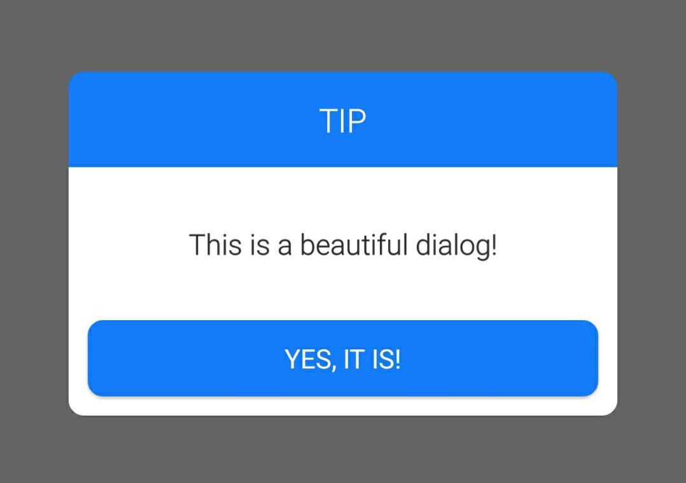

qhdialog
============

<!--  -->

Install
------------

Step 1. Add the JitPack repository to your build file

Add it in your root build.gradle at the end of repositories:

    allprojects {
		repositories {
			...
			maven { url "https://jitpack.io" }
		}
	}

Step 2. Add the dependency

	dependencies {
	        compile 'com.github.qiuh1016:qhdialog:1.0.9'
	}

Usage
--------------

        QHDialog qhDialog = new QHDialog(this,"Title", "Message");
        qhDialog.setPositiveButton("ok", 0, new DialogInterface.OnClickListener(){
            @Override
            public void onClick(DialogInterface dialog, int which){
                Toast.makeText(MainActivity.this, "toast", Toast.LENGTH_SHORT).show();
                dialog.dismiss();
            }
        });
        qhDialog.setNegativeButton("cancel", 0, null);
        qhDialog.show();

If there's only one button and no clickListener:

        QHDialog qhDialog = new QHDialog(this,"Title", "Message");
        qhDialog.setOnlyOneButtonText("OK");
        qhDialog.show();

Contact me
-------------
E-mail: qiuh1016@126.com
QQ: 276655503
WeChat: qiuh1016
